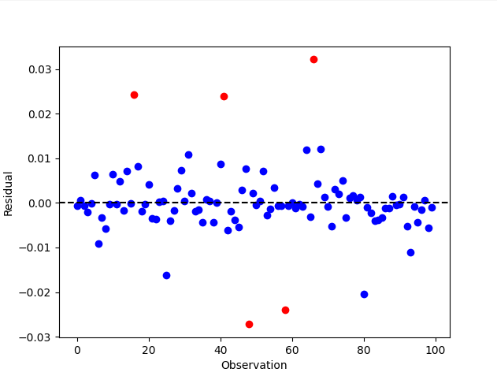

# Outlier Detection 

We will now apply a more advanced example, outlier detection on the UScrime dataset

We will use the method of Szekely and Rizzo[2023] to detect influential observations.

First, run this code

```{code-block} python
:linenos:
import numpy as np
import matplotlib.pyplot as plt
from scipy import stats
from statsmodels.datasets import get_rdataset
from energystats.eda.outlier_detection import find_outliers

df = get_rdataset('Freedman', 'carData').data.dropna()
X = df[['population', 'nonwhite', 'density']].reset_index(drop=True)
y = df['crime'].reset_index(drop=True)
res = find_outliers(X, y, threshold=3, row_names=df.index)
rep = res['dcor_replicates']
mu, _ = stats.norm.fit(rep['replicates'])
residuals = rep['replicates'] - mu
out = rep.index.isin(res['outliers'].index)
```
To obtain the dcor values after removing each sample element, this should follow a normal distribution.
Now 
```{code-block} python
:linenos:

plt.scatter(np.arange(len(residuals))[~out], residuals[~out], c='b')
plt.scatter(np.arange(len(residuals))[out], residuals[out], c='r')
plt.axhline(0, ls='--', color='k')
plt.xlabel('Observation')
plt.ylabel('Residual')
plt.show()
```

Should plot the residuals which have a normal distribution, the output should be something like:


The observations beyond `threshold = 3` standard deviations away should be marked as outliers.